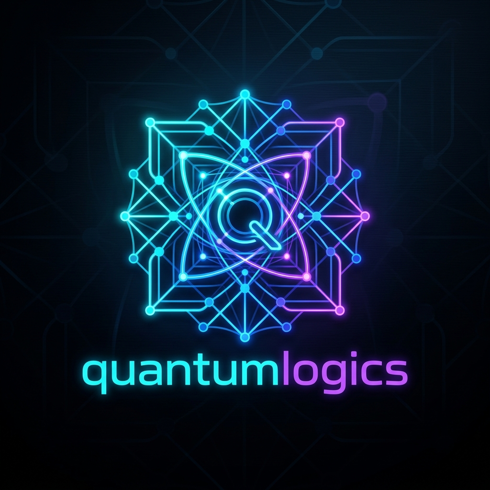

<p align="center">
  
</p>

# QuantumLogics: Unified Quantum-Emulation OS (UQEOS)

**QuantumLogics** is a world-class, production-ready operating system that maps the **32 theoretical capabilities of future quantum computers** onto modern classical hardware (GPUs/CPUs) using advanced Quantum-Inspired algorithms and Tensor Networks.

If you don't have access to a noisy, expensive, and fragile Quantum Processing Unit (QPU), QuantumLogics provides the mathematical abstraction to perform quantum-equivalent physics natively in PyTorch and Rust.

## The 8 Quantum Pillars

This OS handles computations via 8 hyper-optimized, standalone engines routed through a central FastAPI nervous system:

1. ⚡ **`opt` (Optimization & Search)**: Ballistic Simulated Bifurcation (bSB) for logistics and Grover-style search.
2. 🛡️ **`crypto` (Cybersecurity)**: Post-Quantum Trapdoor Tensors (Learning With Errors) for unbreakable encryption.
3. 🧠 **`ai` (Intelligence)**: Matrix Product State (MPS) Neural Layers for highly compressed, tensor-native AI/GenAI.
4. 🧬 **`chem` (Molecular)**: Tensor Variational Quantum Eigensolver (VQE) for drug discovery and ground-state extraction.
5. ⚛️ **`sim` (Physics & Materials)**: Density Matrix Renormalization Group (DMRG) for simulating many-body physics.
6. 📈 **`fin` (Finance & Math)**: Quantum-Inspired Amplitude Estimation for accelerating Monte Carlo risk sampling.
7. 🌍 **`geo` (Earth & Space)**: QUBO meta-routers for planetary-scale climate and aerospace logistics.
8. 🧩 **`sys` (Core & Error Correction)**: Mathematical emulation of Surface Codes and fault-tolerant logical qubits.

## Getting Started

### Using Docker (Recommended)
You can launch the entire 8-pillar Quantum OS using Docker Compose:
```bash
docker-compose up --build
```
The FastAPI router will be available at `http://localhost:8000`.

### Python PyPI Install
```bash
pip install quantumlogics
```

## Documentation & Endpoints
The OS exposes a unified API. Example endpoints:
- `POST /api/v1/opt/maxcut`
- `POST /api/v1/ai/infer`
- `POST /api/v1/crypto/generate_keys`

*Engineered to push classical hardware beyond its limits.*
